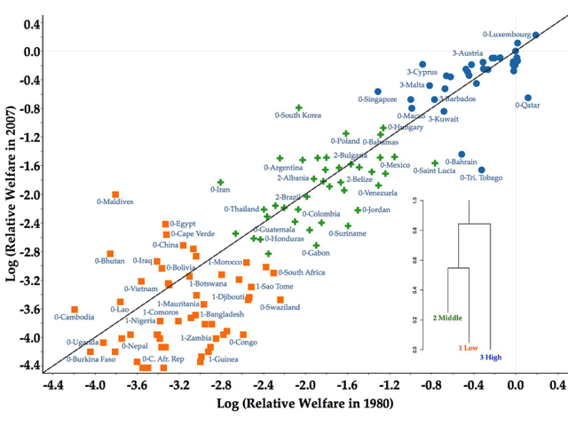
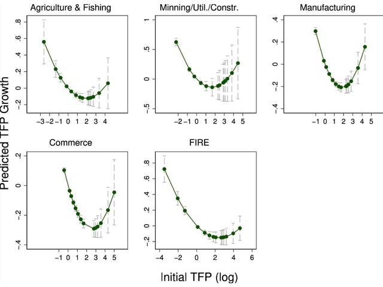
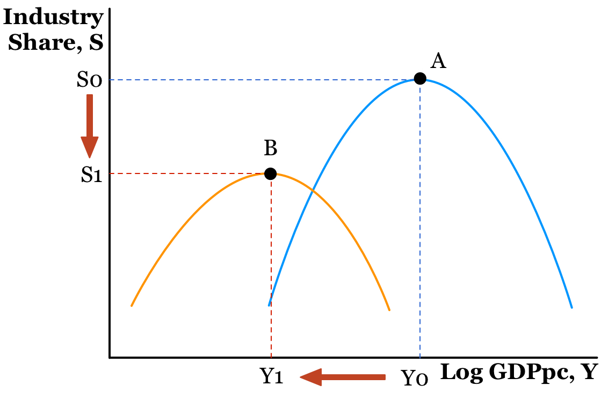
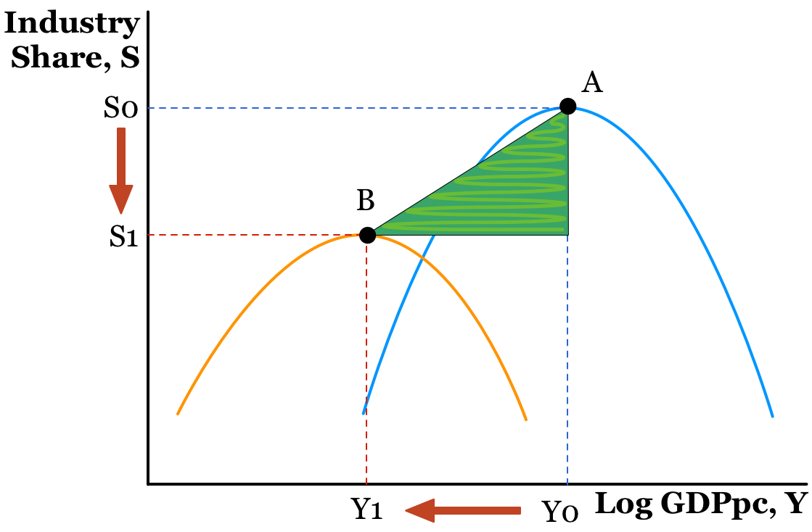
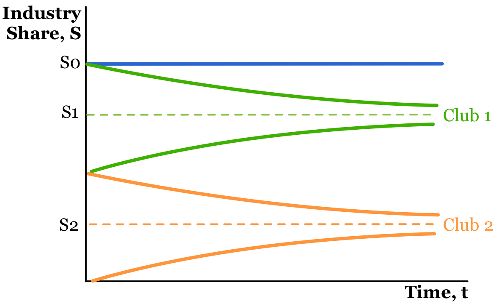

```{r setup, include=FALSE}
options(htmltools.dir.version = FALSE)
```

class: center, middle

# Paper overview

**The Middle-income Trap Reconsidered: The Case of Asia**

Hitoshi Osaka

(Kyoto Sangyo University)

---

class: middle

# Motivation

- Raising interest in the middle-income trap

  - 3860 returns in Google Scholar (as of June 17th, 2018)

--
  
# Objectives

- Investigate the _potential connection_ of two literatures:

  1. The middle-income trap hypothesis
  
  2. The premature deindustrialization hypothesis 

- Apply this _potential connection_ to the context of Asia

---

class: middle

# Data and Methods

- Sample of 27 countries for the period of 1970- 2014

## For the middle income trap:

- Compare the growth rates of the World Bank's income groups:
  
  - MIC growth < LIC growth
  
  - MIC growth < HIC growth

## For the premature deindustrialization hypothesis:

- Pooled cross-section regressions:

  - $Industrialization = f(+GDP, -GDP^2, Controls)$

---

# Results

## For the middle income trap:
  
  - MIC growth > LIC growth
  
  - MIC growth > HIC growth

--

## For the premature deindustrialization hypothesis:

  - $Industrialization = f(+GDP, -GDP^2, (?)Controls)$
  
  - The peak of the inverted-U has declined (only for employment)
  
  - The turning point has declined (for both employment and output)
  
  - More notorious for South Asia
 
--
  
**Implication/warning:**

- Premature deindustrialization in Asia may decrease the growth rates of middle-income countries

---

class: center, middle

# Comments on the middle-income trap

**Endogenous grouping of countries**

**A beta-convergence framework for empirical testing **

---
class: center

# Endogenous grouping of countries



Source: Mendez C. (2017). [Convergence Clubs Beyond GDP: A Non-Parametric Density Approach.](https://carlos-mendez.rbind.io/talk/convergence-clubs-beyond-gdp/) MPRA Working Paper No. 82048

---

class: center

# A beta-convergence framework for empirical testing



Source: Bahar, D. (2018). [The middle productivity trap: Dynamics of productivity dispersion](https://www.sciencedirect.com/science/article/pii/S0165176518300843) Economics Letters, 167, 60-66.
---

class: center, middle

# Comments on premature deindustrialization

**Measuring the premature deindustrialization triangle**

**Finding deindustrialization clubs**

---

# Measuring the premature deindustrialization triangle



---

# How big is the deindustrialization triangle?



---

# Finding deindustrialization clubs



Inspired by Phillips, P. C., & Sul, D. (2007). [Transition modeling and econometric convergence tests](https://onlinelibrary.wiley.com/doi/full/10.1111/j.1468-0262.2007.00811.x). Econometrica, 75(6), 1771-1855. 

---

class: center, middle

# Thank you very much for your attention

https://carlos-mendez.rbind.io

Slides available at: http://bit.ly/jaae2018